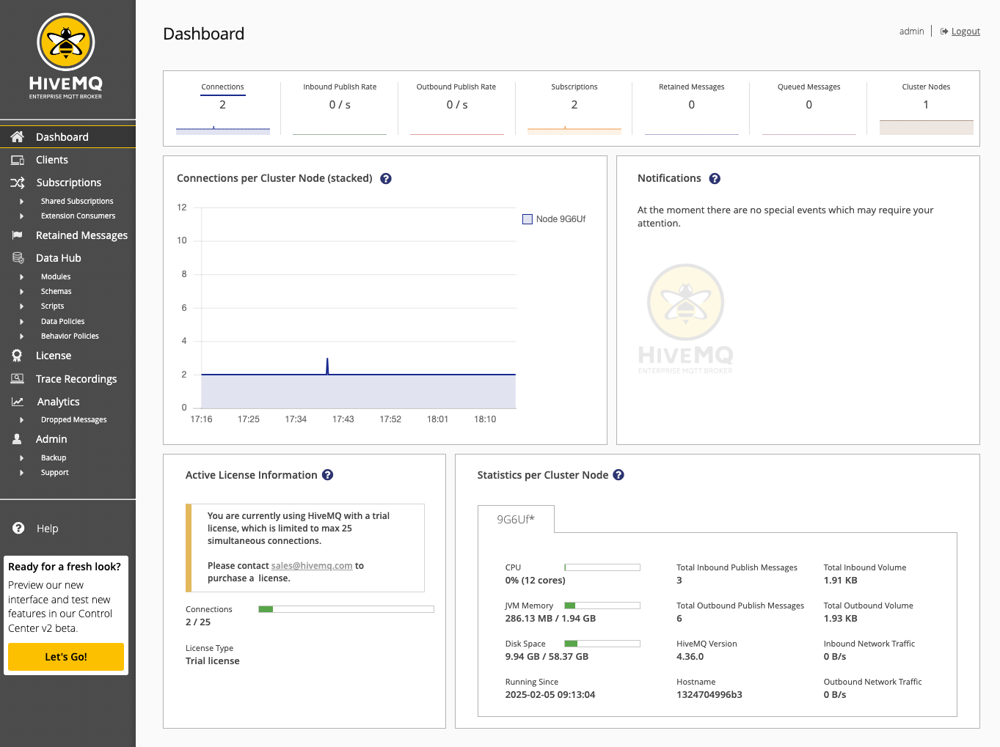
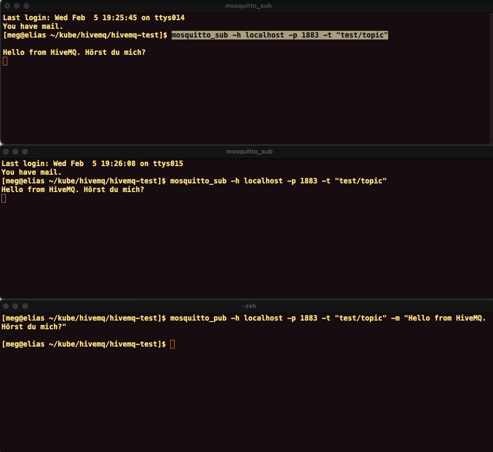

# Test HiveMQ in Docker envronment

## Motivation

Would like to test a technology that is new to me. With
[HiveMQ](https://www.hivemq.com/) one can do pubsub inside Kubernetes
cluster. First let us try with Docker.

## Overview

1. Start HiveMQ in a docker cotainer
2. Test if we can connect to HiveMQ from command line, using mosquitto-client.
3. Test if we can connect to HiveMQ from HiveMQ client for Java programatically.

I used help from ChatGPT to perform following experiment.

### Start docker service

I am on mac and using [Docker desktop for Mac](https://docs.docker.com/desktop/setup/install/mac-install/).
Start Docker Desktop (by double clicking the icon). 

### Start HiveMQ as a container
Follow the [instruction](https://docs.hivemq.com/hivemq/latest/user-guide/docker.html).

```
docker run -p 8080:8080 -p 1883:1883 hivemq/hivemq4
```

Check if the container is running.
```
docker ps
CONTAINER ID   IMAGE            COMMAND                  CREATED       STATUS       PORTS                                                      NAMES
1324704996b3   hivemq/hivemq4   "/opt/docker-entrypo…"   9 hours ago   Up 9 hours   0.0.0.0:1883->1883/tcp, 0.0.0.0:8080->8080/tcp, 8000/tcp   peaceful_northcutt
```

Okay, fine.

Check if we can see HiveMQ console on a browser. Open
```
localhost:8080
```

Initial user is admin, and password is hivemq.



All right. 

### Test with mosquitto client

Install mosquitto on Mac.

```
brew install mosquitto
```

Create a topic and subscribe it. Do this in two teminals. 

```
mosquitto_sub -h localhost -p 1883 -t "test/topic"
```

Then, publish a message to the topic.
```
mosquitto_pub -h localhost -p 1883 -t "test/topic" -m "Hello from HiveMQ. Hörst du mich?"
```




Yeahaa


### Test with HiveMQ Java client

We need to set up 
- JDK
- Maven

but this part is skipped.

First set up a new project with Maven.

```
mvn archetype:generate -DgroupId=com.hivemq.client.test -DartifactId=hivemq-test -DarchetypeArtifactId=maven-archetype-quickstart -DinteractiveMode=false
```

Now your directory looks like this.

```
[meg@elias ~/kube/hivemq/hivemq-test]$ tree -L 1
.
├── README.md
├── images
├── pom.xml
├── src
└── target
```

Add a few lines to ```pom.xml``` so that dependency required to use HiveMQ will be installed.

```

<project xmlns="http://maven.apache.org/POM/4.0.0" xmlns:xsi="http://www.w3.org/2001/XMLSchema-instance"
  xsi:schemaLocation="http://maven.apache.org/POM/4.0.0 http://maven.apache.org/maven-v4_0_0.xsd">
  <modelVersion>4.0.0</modelVersion>
  <groupId>com.hivemq.client.test</groupId>
  <artifactId>hivemq-test</artifactId>
  <packaging>jar</packaging>
  <version>1.0-SNAPSHOT</version>
  <name>hivemq-test</name>
  <url>http://maven.apache.org</url>
  <dependencies>
    <dependency>
      <groupId>junit</groupId>
      <artifactId>junit</artifactId>
      <version>3.8.1</version>
      <scope>test</scope>
    </dependency>     
    <dependency>                          //---- FROM HERE 
      <groupId>com.hivemq</groupId>
      <artifactId>hivemq-mqtt-client</artifactId>
      <version>1.3.0</version>
    </dependency>                         //---- TO HERE
  </dependencies>
```

Write client test program. It is stored in ```src/main/java/com/hivemq/client/test/ClientTest.java```.
Chat GPT did this part. 

### Test HiveMQ Java client

Execute
```
mvn compile exec:java -Dexec.mainClass="com.hivemq.client.test.ClientTest"

[INFO] Scanning for projects...
[INFO]
[INFO] -----------------< com.hivemq.client.test:hivemq-test >-----------------
[INFO] Building hivemq-test 1.0-SNAPSHOT
[INFO]   from pom.xml
[INFO] --------------------------------[ jar ]---------------------------------
[INFO]
[INFO] --- resources:3.3.1:resources (default-resources) @ hivemq-test ---
[WARNING] Using platform encoding (UTF-8 actually) to copy filtered resources, i.e. build is platform dependent!
[INFO] skip non existing resourceDirectory /Users/meg/kube/hivemq/hivemq-test/src/main/resources
[INFO]
[INFO] --- compiler:3.13.0:compile (default-compile) @ hivemq-test ---
[INFO] Nothing to compile - all classes are up to date.
[INFO]
[INFO] --- exec:3.5.0:java (default-cli) @ hivemq-test ---

...

Connection successful.
Message successfully sent.
Received message: Hello from HiveMQ Client.

```

Yeahaa-

<!-- ------------------------------  -->

# END

<!-- ####################  -->
